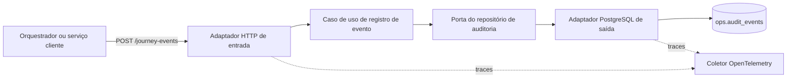
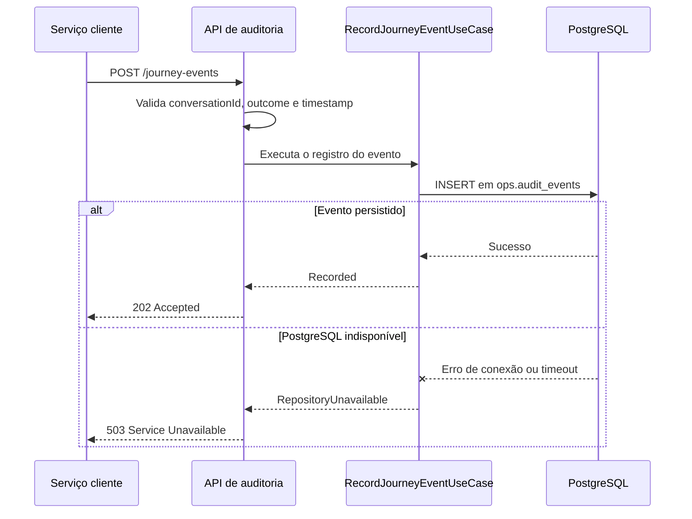

# Serviço de Auditoria de Conversas

Serviço em ASP.NET Core responsável por registrar eventos de auditoria gerados durante o processamento de jornadas conversacionais.

A API recebe informações sobre a conversa, intenção, resultado e data do processamento, valida a solicitação e persiste o evento na tabela `ops.audit_events` do PostgreSQL. O serviço também exporta rastreamentos distribuídos por meio do OpenTelemetry.

## O que este serviço faz

- Recebe eventos de jornada pelo endpoint `POST /journey-events`.
- Valida o identificador da conversa, o resultado e o timestamp do evento.
- Registra o evento na tabela `ops.audit_events`.
- Armazena `intent` e `outcome` em uma coluna JSONB.
- Retorna `503 Service Unavailable` quando o PostgreSQL não está acessível.
- Exporta traces do ASP.NET Core e do Npgsql por OTLP.
- Adiciona `TraceId`, `SpanId` e `ParentId` aos logs da aplicação.

## Arquitetura

O código utiliza portas e adaptadores, seguindo os princípios da arquitetura hexagonal:



### Fluxo da solicitação



## Tecnologias

| Área | Tecnologia |
|---|---|
| Runtime | .NET 8 |
| API | ASP.NET Core Minimal APIs |
| Documentação da API | Swagger / OpenAPI |
| Banco de dados | PostgreSQL |
| Acesso a dados | Npgsql |
| Observabilidade | OpenTelemetry + OTLP |
| Containerização | Docker com build multi-stage |

## Referência da API

### Registrar um evento de jornada

```http
POST /journey-events
Content-Type: application/json
```

#### Corpo da solicitação

```json
{
  "conversationId": "conversation-12345",
  "intent": "renegociar_divida",
  "outcome": "journey_completed",
  "timestamp": "2026-07-18T15:30:00Z"
}
```

| Campo | Tipo | Obrigatório | Descrição |
|---|---|---:|---|
| `conversationId` | string | Sim | Identificador da conversa auditada. |
| `intent` | string ou `null` | Não | Intenção identificada durante a conversa. |
| `outcome` | string | Sim | Resultado do processamento da jornada. |
| `timestamp` | string ISO 8601 | Sim | Data e hora em que o evento ocorreu. |

#### Respostas

| Status | Significado |
|---:|---|
| `202 Accepted` | O evento foi persistido com sucesso. |
| `400 Bad Request` | `conversationId`, `outcome` ou `timestamp` não foi informado corretamente. |
| `503 Service Unavailable` | O PostgreSQL está indisponível ou excedeu o timeout. |
| `500 Internal Server Error` | Ocorreu uma falha inesperada na aplicação. |

#### Exemplo com cURL

```bash
curl --request POST \
  --url http://localhost:5021/journey-events \
  --header 'Content-Type: application/json' \
  --data '{
    "conversationId": "conversation-12345",
    "intent": "renegociar_divida",
    "outcome": "journey_completed",
    "timestamp": "2026-07-18T15:30:00Z"
  }'
```

## Comportamento da persistência

A implementação atual converte o evento recebido para o modelo genérico da tabela `ops.audit_events`.

| Coluna | Valor persistido |
|---|---|
| `tenant_id` | `00000000-0000-0000-0000-000000000001` |
| `actor_type` | `system` |
| `actor_id` | `conversation-orchestrator` |
| `action` | `conversation.journey_processed` |
| `resource_type` | `conversation` |
| `resource_id` | Valor recebido em `conversationId` |
| `payload` | JSON contendo `intent` e `outcome` |
| `created_at` | Valor recebido em `timestamp` |

Exemplo do conteúdo persistido em `payload`:

```json
{
  "intent": "renegociar_divida",
  "outcome": "journey_completed"
}
```

> [!IMPORTANT]
> `tenant_id`, `actor_type`, `actor_id`, `action` e `resource_type` são valores fixos no código. Atualmente, o cliente não pode alterar esse mapeamento pela API.

O banco de dados deve possuir previamente:

- O schema `ops`.
- A tabela `ops.audit_events`.
- Colunas compatíveis com o comando de inserção documentado acima.

Este repositório não contém migrações de banco. Os comentários do código também fazem referência a um arquivo `design.md`, mas esse arquivo não está presente no repositório.

## Configuração

A configuração pode ser fornecida por `appsettings.json`, arquivos específicos de ambiente ou variáveis de ambiente.

| Configuração | Variável de ambiente | Valor padrão |
|---|---|---|
| Connection string do PostgreSQL | `Postgres__ConnectionString` | `Host=localhost;Port=5432;Database=conversational_ai;Username=postgres;Password=postgres` |
| Endpoint OTLP | `Otel__OtlpEndpoint` | `http://localhost:4317` |

Os timeouts de conexão e execução de comandos no PostgreSQL são limitados a cinco segundos. Dessa forma, falhas de banco são convertidas rapidamente em `503 Service Unavailable`.

## Executar localmente

### Pré-requisitos

- .NET 8 SDK.
- PostgreSQL com o schema e a tabela necessários.
- Coletor compatível com OTLP, como Jaeger ou OpenTelemetry Collector, quando a exportação de traces for necessária.

### Iniciar o serviço

```bash
dotnet restore
dotnet run --launch-profile http
```

O perfil HTTP inicia a aplicação em:

```text
http://localhost:5021
```

O Swagger fica disponível no ambiente `Development` em:

```text
http://localhost:5021/swagger
```

O perfil HTTPS utiliza:

```text
https://localhost:7053
```

### Sobrescrever configurações

Linux ou macOS:

```bash
export Postgres__ConnectionString='Host=localhost;Port=5432;Database=conversational_ai;Username=postgres;Password=postgres'
export Otel__OtlpEndpoint='http://localhost:4317'
dotnet run --launch-profile http
```

PowerShell:

```powershell
$env:Postgres__ConnectionString = 'Host=localhost;Port=5432;Database=conversational_ai;Username=postgres;Password=postgres'
$env:Otel__OtlpEndpoint = 'http://localhost:4317'
dotnet run --launch-profile http
```

## Executar com Docker

### Criar a imagem

```bash
docker build -t conversation-audit-service .
```

### Iniciar o container

```bash
docker run --rm \
  --name conversation-audit-service \
  --publish 8080:8080 \
  --env Postgres__ConnectionString='Host=host.docker.internal;Port=5432;Database=conversational_ai;Username=postgres;Password=postgres' \
  --env Otel__OtlpEndpoint='http://host.docker.internal:4317' \
  conversation-audit-service
```

O endpoint ficará disponível em:

```text
http://localhost:8080/journey-events
```

No Linux, o acesso a serviços executados diretamente no host pode exigir:

```bash
--add-host=host.docker.internal:host-gateway
```

## Observabilidade

O serviço configura o OpenTelemetry com:

- Instrumentação de requisições do ASP.NET Core.
- Instrumentação das operações do Npgsql.
- Exportação de traces por OTLP.
- Nome do serviço `conversation-audit-service`.
- Correlação de `TraceId`, `SpanId` e `ParentId` nos logs de console.

O span do PostgreSQL é especialmente relevante porque a disponibilidade e a latência da persistência determinam se o endpoint retorna `202` ou `503`.

## Estrutura do projeto

```text
.
├── Adapters
│   ├── Inbound/Http
│   │   └── JourneyEventEndpoints.cs
│   └── Outbound/Persistence
│       └── PostgresJourneyEventRepository.cs
├── Application
│   ├── Ports
│   │   ├── Inbound
│   │   └── Outbound
│   └── UseCases
│       └── RecordJourneyEventUseCase.cs
├── Configuration
│   ├── OtelOptions.cs
│   └── PostgresOptions.cs
├── Domain
│   └── JourneyAuditEvent.cs
├── Program.cs
├── appsettings.json
├── Dockerfile
└── conversation-audit-service.csproj
```

## Limitações atuais

- O tenant é fixo para todos os eventos.
- O ator é sempre identificado como `conversation-orchestrator`.
- A ação é sempre `conversation.journey_processed`.
- Não existe autenticação ou autorização.
- Não existe mecanismo de idempotência.
- As migrações de banco são gerenciadas fora deste repositório.
- Não existem endpoints de health check.
- Falhas de persistência não possuem retry.
- O endpoint não impõe um catálogo de valores permitidos para `intent` ou `outcome`.
- Não há validação explícita para timestamps futuros ou excessivamente antigos.

## Próximos passos recomendados

1. Tornar tenant, ator e ação derivados do contexto autenticado ou do evento.
2. Adicionar autenticação, autorização e rate limiting.
3. Implementar idempotência para impedir eventos duplicados.
4. Adicionar migrações de banco e testes de integração.
5. Criar health checks de readiness e liveness.
6. Adicionar políticas de resiliência e métricas operacionais.
7. Validar o catálogo de eventos, intenções e resultados aceitos.
8. Definir uma política de retenção e proteção dos dados de auditoria.
